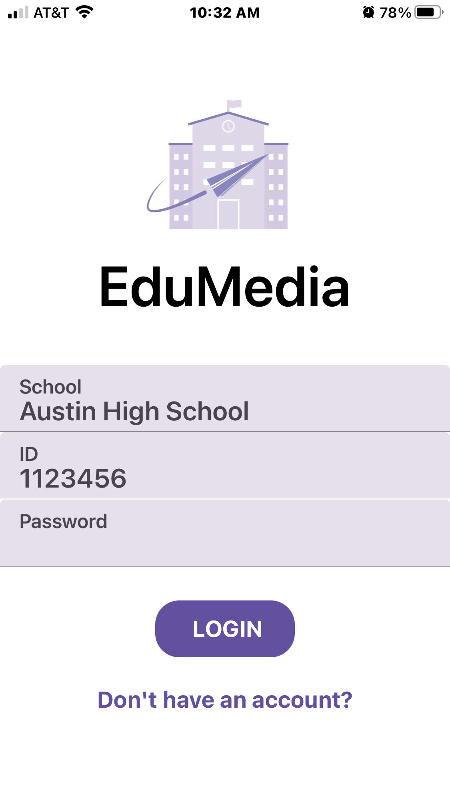
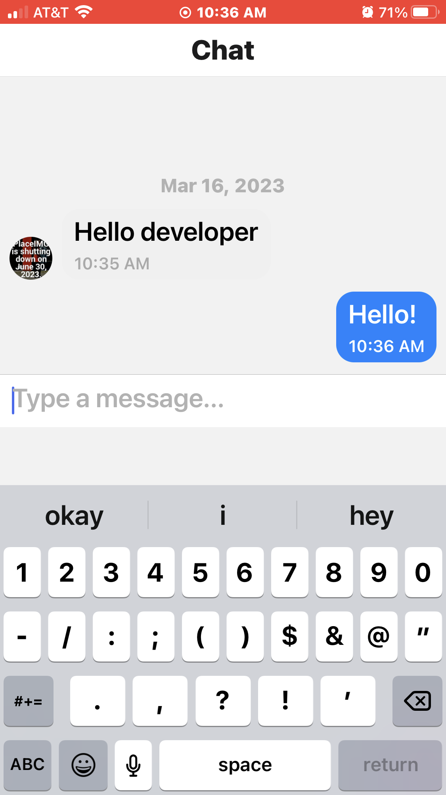
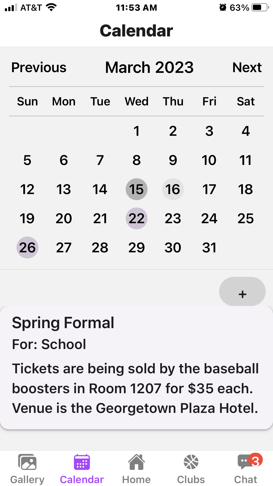
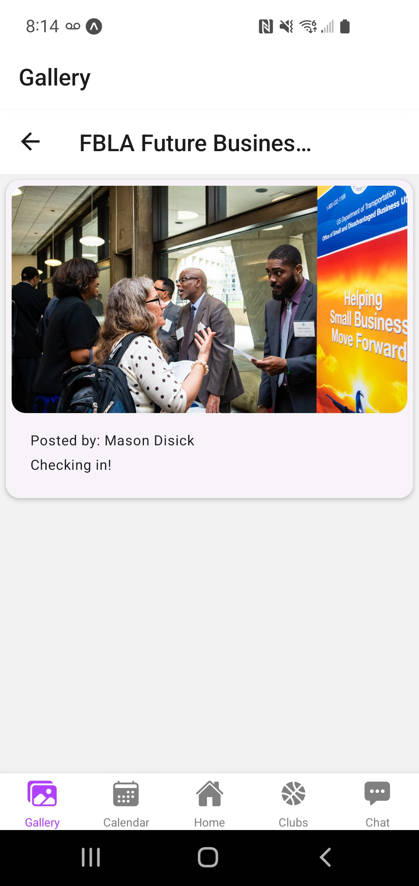

# EduMedia
EduMedia is a cross-platform mobile application that connects students, parents, and educators by offering a platform to meet everyone's school-related needs. Communicate with teachers quickly using our live chat feature, browse offered clubs, view upcoming events, post pictures to school/club-wide galleries and so much more!

## Login
The `Login` screen signs in the user, directing them to the correct page depending on their role. Students have premade accounts, and parents are given the option to create new accounts linking to their child. We secure client information by hiding passwords, only storing password hashes, and using email verification to verify new accounts. 

 

## Home
The `Home` screen includes navigation to view the user's information and settings along with the user's (or their child's) schedule. The bottom tab menu allows users to move quickly between the different features.

## Clubs
The `Clubs` screen lets users browse and view different clubs offered at their respective school. Student Leaders/Sponsors can edit club information and add new events relating the club. Users can also share club posters to Instagram to further promote their club.

 

## Chat
The `Chat` screen offers a live chat feature for students and parents to communicate with educators. This allows users to ask questions, send reminders to students, and report absences.

## Calendar
The `Calendar` screen shows both school-wide and club events that correspond to the respective user. Clients can also create personal events.

 

## Gallery
The `Gallery` screen lets users upload pictures to differnt clubs. Students can share what their club is doing by directly uploading pictures.

 

## Design
- [Figma Wireframe](https://innerspacecavern.com/)

## Languages and Software Used
- JavaScript
- React Native
- NodeJS
- Parse SDK
- Back4App
- ExpoGo
- Github
- VSCode

## License
- &copy; 2022 Laasya Yatham, Marcus Alagar. All rights reserved.

## Contributors
- Laasya Yatham
- Marcus Alagar
